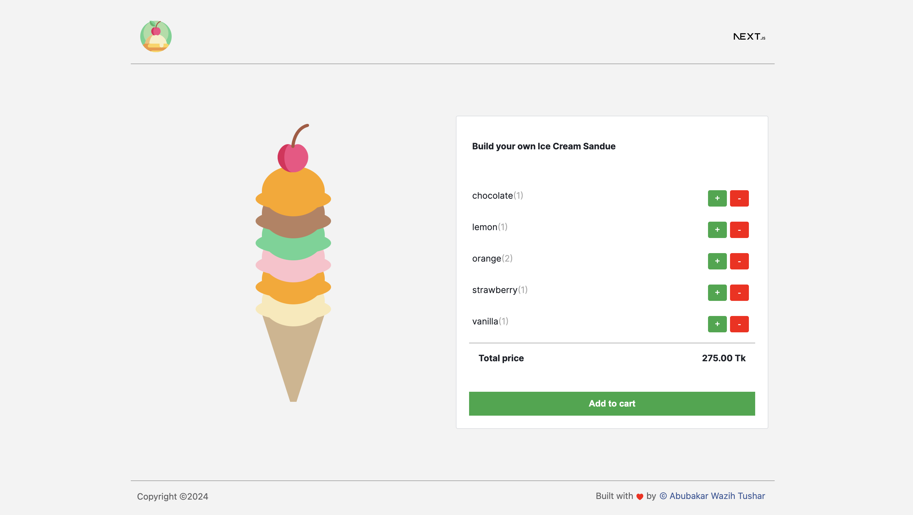

# React Next.js Ice Cream Builder



## Description

The React Next.js Ice Cream Builder is a web application that allows users to create and customize their own virtual ice cream cones. Built with React and Next.js, this application provides a fun and interactive experience for ice cream enthusiasts of all ages.

## Technologies Used

- React.js
- Next.js
- CSS (or styled-components)
- Firebase (optional, for authentication or database storage)
- External APIs for additional features (e.g., weather API for seasonal flavors)

## Getting Started

To get started with the React Next.js Ice Cream Builder, follow these steps:

1. Clone the repository:

   ```bash
   git clone https://github.com/algo-tushar/React-NextJs-ice-cream-builder.git
   ```

2. Install dependencies:

   ```bash
   npm install
   # or
   yarn install
   ```

3. Start the development server:

   ```bash
   npm run dev
   # or
   yarn dev
   ```

4. Open your browser and navigate to `http://localhost:3000` to view the application.

## License

This project is licensed under the [MIT License](LICENSE), allowing for free and open use, modification, and distribution.

---

[](https://opensource.org/licenses/MIT)